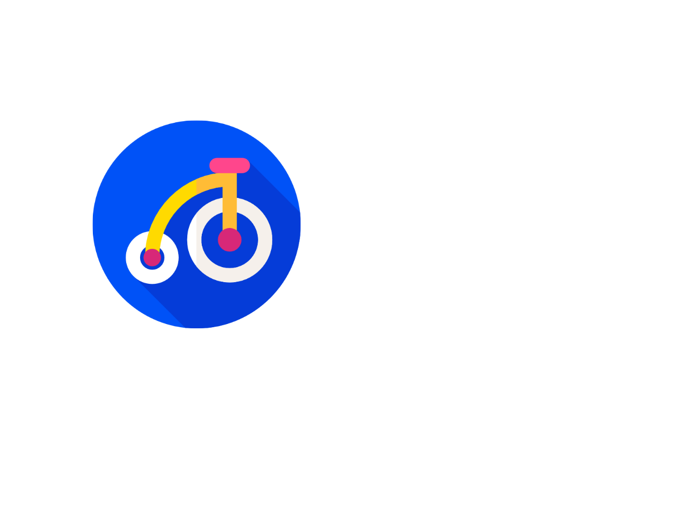
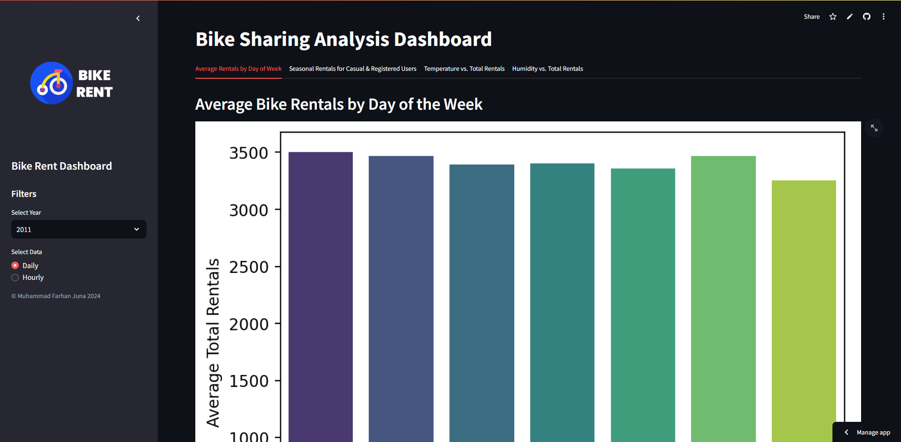

# Bike Sharing Analysis

This project analyzes bike sharing data to understand the factors influencing bike rental usage. 




## Setup Environment - Anaconda
```
conda create --name main-ds python=3.9
conda activate main-ds
pip install -r requirements.txt
```

## Setup Environment - Shell/Terminal
```
mkdir proyek_analisis_data
cd proyek_analisis_data
pipenv install
pipenv shell
pip install -r requirements.txt
```

## Run steamlit app
```
streamlit run dashboard.py
```

You can also access the deployed version of the app here:  
[Bike Sharing Streamlit App](https://bike-sharing-analysis-iuwwmsbj4kafr4c4qxwprs.streamlit.app/)


## Project Overview

This project aims to explore and analyze bike sharing data to identify patterns and trends in rental usage. We will analyze various factors such as weather conditions, season, day of the week, and user type to gain insights into how these factors influence bike rentals.

## Data Source

The dataset used in this project is from a bike sharing system, which contains information on daily and hourly bike rentals.

## Analysis Questions

The project focuses on answering several key questions related to bike sharing usage:

1. **Does weather affect the number of bike users?**
2. **What are the usage patterns for weekdays, holidays, and weekends?**
3. **What is the yearly trend in bike usage? Was it higher in 2011 or 2012?**
4. **How do factors like temperature and humidity impact the total number of bike users, including casual and registered users?**
5. **Does season influence the number of bike renters, particularly the differences between casual and registered customers?**


## Analysis Methods

The project employs various data analysis techniques:

* **Descriptive statistics:** To summarize and describe the data.
* **Data visualization:** To explore relationships and patterns through plots (bar charts, scatter plots, line charts, heatmaps).
* **Correlation analysis:** To understand the relationships between different variables.
* **Data aggregation and grouping:** To analyze data by different categories (weather, season, day of the week).

## Key Findings

The analysis reveals several insights:

* **Weather:** Weather significantly impacts bike rentals. Sunny and warm weather increases rentals, while bad weather decreases them.
* **Season:** Summer has the highest average bike rentals, likely due to warmer and brighter weather. Fall has the lowest. 
* **Day of Week:** Bike rentals are typically higher on weekdays than weekends, indicating commuter usage.
* **User Types:** Registered users tend to rent bikes more consistently throughout the year, regardless of weather. Casual users are more sensitive to weather conditions.

## Conclusion

The analysis indicates that various factors, including weather, season, day of the week, and user type, influence bike rental usage. Understanding these patterns can help bike sharing companies manage inventory and marketing strategies more effectively.

## Future Work

Further analysis can explore:

* Combined effects of weather and workday/holiday.
* Combined effects of season and temperature.
* Hourly and daily usage patterns.
* Linear regression for rental prediction.
* Cluster analysis to group users based on their usage patterns.


## Repository Structure

The repository contains the following:

* **Notebooks:** Jupyter notebooks with code for data analysis.
* **Data:** Input data files (if applicable).


## Getting Started

1. Clone the repository: `git clone https://github.com/mjuna12/bike-sharing-analysis.git`
2. **Install Dependencies:** You may need to install libraries like `pandas`, `numpy`, `matplotlib`, and `seaborn`.
3. **Run the notebooks:** Open the notebooks in a Jupyter environment and run the code to reproduce the analysis.
 


I hope this README provides a good overview of the project. Feel free to explore the code and notebooks to delve deeper into the analysis.
